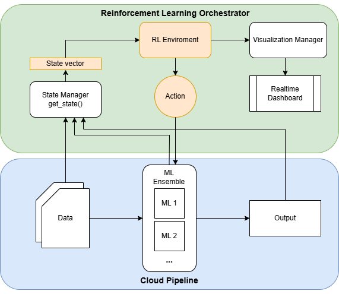
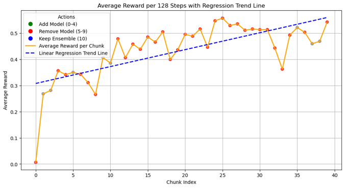
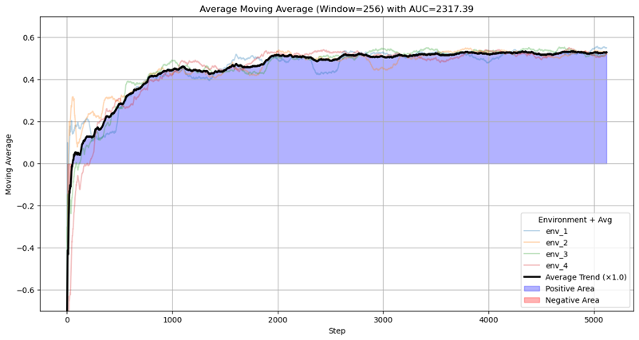
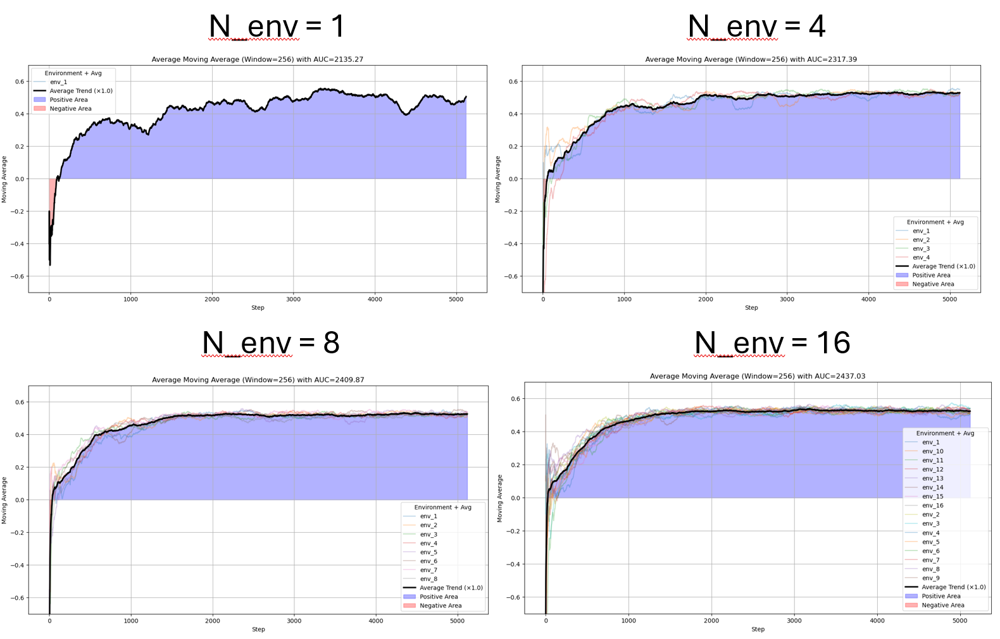
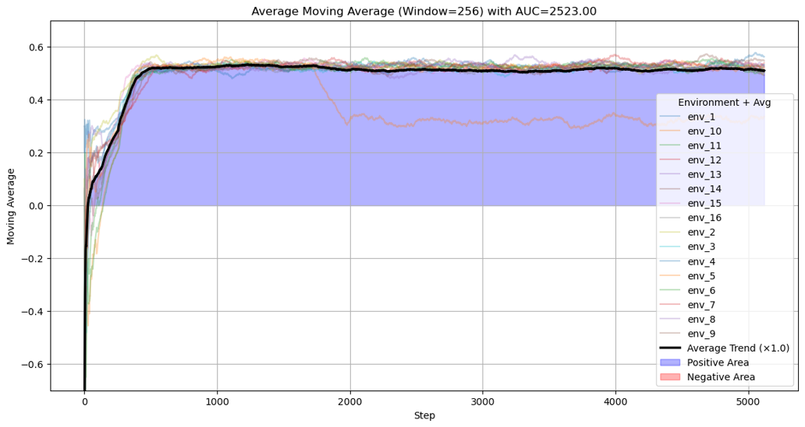
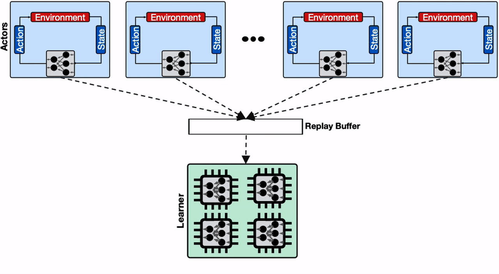

# Reinforcement Learning ML Ensemble Orcherstration

The goal of this research is to develop a **reinforcement learning (RL) component** that can dynamically orchestrate a **machine learning (ML) ensemble**, optimizing for user-defined metrics. This component aims to be part of a larger orchestration project by the Aalto Sea group, [ROHE Orchestrator](https://github.com/minhtribk12/ROHE_orchestrator).

The RL algorithm is able to learn the optimal ensemble during the ML inference without knowing any prior knowledge about the model performance. It does so by adding and removing models in real time and observing the rewards.

In this research project I:
- developed a modular **set of functions** to create an RL enviroment that can be adapted to any ML pipeline
- tested the performance of a **PPO model** orchestrating the ML pipeline on a simulated [ImageNET](https://www.image-net.org/) [2] image recognition task** with **different parameters** and **architectures**.
- explored the advantages and tradeoffs of **parallelizing the learning enviroments**, using the [OpenAI Gym](https://gymnasium.farama.org/) [3] library.
- conducted tests on the [CSC Puhti Supercomputer](https://docs.csc.fi/computing/systems-puhti/) in Finland.

# 1. Design 

## 1.1 RL System components

The main components of the RL add-on:

1. **RL Enviroment** (enviroment_manager.py)
   - A Gym enviroment that can run different models, utilizing the State Manager to get the current state during each step.

2. **State Manager** (state_manager.py)
   - **Function 1: Config Pipeline**
     - Configures the pipeline based on the settings in the provided config file.
   - **Function 2: Get State**
     - Retrieves the current state at any given moment and sends it to the RL model.

3. **Visualizer** (visualization_manager.py)
   - Collects the outputs and generates visualizations and metrics, allowing for the evaluation of different RL policies within the cloud environment.

4. **Utils**
   - **Config Manager** (config_manager)
     - Modifies the YAML file, enabling various actions to be called by the RL model.
   - **Model RL** (model_rl)
     - Simulates ML inference based on the content specified in the YAML file.
     - Part of the [ROHE library](https://github.com/minhtribk12/ROHE_orchestrator) [1].

## 1.2 PPO Design 

### Action Space
The action space of the model is: one action for adding each model in the list, one action for removing each model, one action to keep the ensemble as is.

### Steps
Each step the model performs:
- one action on the ensemble (either adding a model, removing it or keeping it as is).
- a certain number of inferences with that particular ensemble (we set the default to 100 inferences).
- compute the reward over these inferences based on the predefined weights in the contract (accuracy, energy estimate, etc..).

### Reward Function and User-Defined Metrics
The reward of the RL model is defined by the following formula:

**Reward = Σ(αᵢ * f(xᵢ))**

Where:
- **αᵢ** is a set of weights describing what metrics the user prioritizes.
- **f(xᵢ)** is a function applied to the metrics that normalizes their value to [0, 1].

#### Inference Metrics
The inference metrics considered for now are:
- **Accuracy**
- **Confidence**
- **Explainability**
- **Latency**
- **Energy**

# 2. Testing 

## 2.2 The accuracy test

We design a test to validate the learning performance on our model, I chose to target accuracy as this straightforward approach would allow me to understand better the reasoning of the model. I hope to conduct more tests with mixed rewards in the future.

We want to check if overtime the model learns to include the models with the highest accuracy and discard the ones with less accuracy over time.

- Target: 100% accuracy
- Total_num_models = 5
- Num-Actions = 11
- List of models =  ["EfficientNetV2S", "DenseNet121", "ResNet50", "MobileNetV2", "NASNetLarge"]
- Best performing model ensemble: [1. EfficientNetV2S, 2. Nas NETLarge]

The reward is normalized to be approximately in the range of [-1,1] by setting accuracy of 0.9 as the average reward.

Below are the accuracies of the 5 models:

| Model           | Overall Accuracy |
|----------------|------------------|
| EfficientNetV2S | 0.9539           |
| NASNetLarge     | 0.9430           |
| DenseNet121     | 0.8664           |
| ResNet50        | 0.8398           |
| MobileNetV2     | 0.8261           |

## 2.3 Different Parameters

I tried evaluating the performance of the PPO model with different hyperparameters to find an optimal configuration that can perform best in our scenario.

Below is a categorized summary of PPO experiments based on the hyperparameter being varied:

---

### Baseline run

| Job Name           | Key Change | n_envs | learning_rate | clip_range | CPUs | Elapsed   | Notes             |
|--------------------|------------|--------|----------------|-------------|------|-----------|-------------------|
| `run-job_4env.sh`  | Baseline   | 4      | 3e-4           | 0.2         | 16   | 04:42:38  | Reference setup   |

This is the average reward per 128 steps, or each time the policy is updated. I fitted a linear regression on these results showing a `p_value = 0` for the index variable meaning there is **statistical significance** that the model is learning.

This is the moving average of the reward of the 4 learning enviroments over time, leading to a clear stabilization at the 0.95 accuracy after 2000 steps.

---

## Other Results

To visualize the training performance for a specific configuration, download the Git repository and open the `results_visualization.ipynb` notebook.
-  Set `directory = "results/ppo_test_{config}"` to load and plot the results from the 8-environment PPO training run.

---

### Learning Rate Sensitivity

In general the learning rate didn't seem to affect the learning speed that much as the policy update was mostly limited by the clip_range parameter.

| Job Name                 | Key Change   | n_envs | learning_rate | clip_range | CPUs | Elapsed   | Notes                      |
|--------------------------|--------------|--------|----------------|-------------|------|-----------|----------------------------|
| `run-job_highlearn.sh`   | High LR      | 4      | 1e-3           | 0.2         | 32   | 04:35:05  | Faster learning            |
| `run-job_lowlearn.sh`    | Low LR       | 4      | 1e-3           | 0.2         | 32   | 04:10:42  | Lower than baseline        |

---

### Clip Range Sensitivity

Increasing the clip_range parameter allowed the models to learn much faster, the tradeoff is that a model might converge to a local maximum and achieve sub-optimal results. This can be alleviated by using a large number of enviroments as we will see in the final proposed test. 

| Job Name                 | Key Change     | n_envs | learning_rate | clip_range | CPUs | Elapsed   | Notes                          |
|--------------------------|----------------|--------|----------------|-------------|------|-----------|--------------------------------|
| `run-job_lowclip.sh`     | Low clip       | 4      | 3e-4           | 0.1         | 16   | 05:08:14  | Conservative updates           |
| `run-job_highclip.sh`    | High clip      | 4      | 3e-4           | 0.4         | 32   | 04:02:45  | Larger update allowance        |

---

### Architecture Sensitivity

The default architecture for the .. proved to be a solid choice. A smaller architecture whie much faster didnt learn the correct policy properly. Check results in correspondent file ppo_test_smallarchitecture

| Job Name                    | Key Change | n_envs | learning_rate | clip_range | CPUs | Elapsed   | Notes                        |
|-----------------------------|------------|--------|----------------|-------------|------|-----------|------------------------------|
| `run-job_smallarchitecture.sh` | Small net | 4      | 3e-4           | 0.2         | 16   | 01:05:46  | Lightweight `[64, 64]`       |
| `run-job_deeparchitecture.sh`  | Deep net  | 4      | 3e-4           | 0.2         | 16   | 04:49:44  | Deep `[256, 128, 64]`        |

---

### CPU Core Allocation

See discussion in **section 3** 

| Job Name          | Key Change | n_envs | learning_rate | clip_range | CPUs | Elapsed   | Notes                  |
|-------------------|------------|--------|----------------|-------------|------|-----------|------------------------|
| `run-job_1cpu.sh` | 1 CPU      | 4      | 3e-4           | 0.2         | 1    | 07:40:00  | CPU-limited setup      |
| `run-job_4cpu.sh` | 4 CPUs     | 4      | 3e-4           | 0.2         | 4    | 05.42.10         | CPU-limited setup    |
| `run-job_16cpu.sh`  | 16 CPU   | 4      | 3e-4           | 0.2         | 16   | 04:42:38  | Reference setup   |
| `run-job_32cpu.sh`  | 32 CPU   | 4      | 3e-4           | 0.2         | 16   | 04:32:51  | Reference setup   |

---

## 2.4 Parallelization 

I tried using Stable Baselines vec_env feature for parallel environments to speed up and stabilize PPO training. 
Additionaly to the learning performance benefits I was also interested in testing how it **performs on the CSC puhti** supercomputer in terms of scalability. 

More information on that and my conclusions on parallel and distributed learning in High Performance Enviroments in **section 3**. 

| Job Name            | Key Change      | n_envs | learning_rate | clip_range | CPUs | Elapsed   | Notes                    |
|---------------------|-----------------|--------|----------------|-------------|------|-----------|--------------------------|
| `run-job_1env.sh`   | Fewer envs      | 1      | 3e-4           | 0.2         | 16   | 01:11:34  | Less parallelism         |
| `run-job_4env.sh`  | Baseline   | 4      | 3e-4           | 0.2         | 16   | 04:42:38  | Reference setup   |
| `run-job_8env.sh`   | More envs       | 8      | 3e-4           | 0.2         | 32   | 08:10:30  | Moderate parallelism     |
| `run-job_16env.sh`  | High envs       | 16     | 3e-4           | 0.2         | 64   | 15:45:28  | High parallelism         |

The plots show how increasing the number of parallel environments **(n_env)** improves both learning speed and stability in PPO training. As n_env increases from 1 to 16, the average reward **converges faster** and the area under the curve (AUC) steadily improves, indicating more consistent and efficient policy updates.

---

## 2.5 Proposed Optimal Application

Based on the previous observations I select the following as the optimal configuration for ML inference orchestration:

| Job Name            | Key Change      | n_envs | learning_rate | clip_range | CPUs | Elapsed   | Notes                    |
|---------------------|-----------------|--------|----------------|-------------|------|-----------|--------------------------|
| `run-job_16env_highrate.sh` | High envs + High LR | 16 | 3e-3 | 0.2         | 64   | 15:49:12  | High parallelism + LR    |

The configuration with n_envs=16 and a high learning rate (3e-3) achieved the best overall performance, reaching the highest AUC of 2523.00. The policy converged rapidly and maintained stability across all environments, demonstrating both learning efficiency and robustness in parallel execution.

# 3. Implementation remarks: Paralleliztion and CSC Enviroment

### Parallelization with `vec_env` in Stable Baselines3

Stable Baselines3 leverages the `vec_env` module to enable parallel experience collection by running multiple copies of the environment in parallel subprocesses. This can be especially beneficial for on-policy algorithms like PPO, where frequent data collection is required to update the policy. 

`SubprocVecEnv` and `DummyVecEnv` wrappers manage this parallelization, vectorizing the enviroments in processes that ca be run in parallel. In practice instead of passing one action, reward per step the parallel enviroment passes a **vector of action and reward of size n**.

However, `vec_env` parallelism is limited to a **single physical node**, which restricts scalability when CPU resources are saturated. Although increasing the number of CPUs per job improves throughput to some extent, there is a diminishing return due to the lack of **true distributed execution** across multiple machines. 

Overall, as it is evident form my testing times, this is not ideal in HPC clusters like CSC resulting in low horizontal scalability.

---

### Job Timings (Parallel and CPU Comparison)

#### Almost inear increase in parallelization times
- `run-job_1env.sh`: **01:11:34**
- `run-job_4env.sh`: **04:42:38**
- `run-job_8env.sh`: **08:10:30**
- `run-job_16env.sh`: **15:45:28**

#### DIminishing returns on CPU Cores 
- `run-job_1cpu.sh`: **07:40:00**
- `run-job_4cpu.sh`: **05:42:10**
- `run-job_16cpu.sh`: **04:42:38**
- `run-job_32cpu.sh`: **04:32:51**

As shown, increasing the CPU count reduces training time, but only up to a point. The jump from 16 to 32 CPUs yields only marginal speedup due to the limitation of running within a **single-node architecture**.

---

### Limitation: Parallelization Bound to a Single Node

The main bottleneck is that `vec_env` parallelization does not scale beyond a single machine. All subprocesses are bound to the same host, sharing memory and compute resources. As a result, once the available CPU cores on the machine are saturated, adding more environments or CPU threads offers **no significant speedup**.

To overcome this, **true distributed training across multiple nodes** is needed. This would involve separate learners or actors running on different machines and communicating via **HTTP or gRPC** to share gradients and synchronize models—something not currently supported by `vec_env`.

Yazdanbakhsh, A., & Chen, J. (2020, October 2). *Massively Large-Scale Distributed Reinforcement Learning with Menger*. Google AI Blog. 

---

### Future Work: Distributed RL with RLlib

As a direction for future research I want to try using natively **distributed reinforcement learning** frameworks like **Ray RLlib**, which supports asynchronous actor-learner paradigms and distributed rollout workers. RLlib can run on clusters and coordinate workers across nodes using efficient communication protocols. 

Such an architecture would open the door to applying reinforcement learning in **large-scale cloud orchestration scenarios**, though the research field for this particular application is young and needs more investigation. 

Most RL efforts in the past have been mostly related to simple enviroments or robotic applications.

# 4. Potential future research

- **Deepen understanding of mixed reward settings**  
  Further investigate how different reward signals interact and influence policy learning in complex environments.

- **Develop a fully parallelized multi-node environment**  
  Implement a distributed training framework capable of running across multiple machines, communicating policy gradients through HTTP requests to enable scalable reinforcement learning.

- **Evaluate additional model architectures**  
  Expand testing to include a broader range of models to assess generalization and performance across varying architectures.

- **Explore applications in other cloud orchestration scenarios**  
  Apply the developed methods to real-world domains such as Internet of Things (IoT), drone fleets, and dynamic network management to evaluate their effectiveness in practical, cloud-native contexts.

# 5. References

- [1] Nguyen, T., Truong, L., Arcaini, P., & Ishikawa, F. (2024). *Optimizing multiple consumer-specific objectives in end-to-end ensemble machine learning serving*. In *Proceedings of the IEEE/ACM International Conference on Utility and Cloud Computing*.

- [2] Deng, J., Dong, W., Socher, R., Li, L.-J., Li, K., & Fei-Fei, L. (2009). *ImageNet: A large-scale hierarchical image database*. In 2009 IEEE Conference on Computer Vision and Pattern Recognition (pp. 248–255). IEEE. https://doi.org/10.1109/CVPR.2009.5206848

-  [3] Brockman, G., Cheung, V., Pettersson, L., Schneider, J., Schulman, J., Tang, J., & Zaremba, W. (2016). *OpenAI Gym*. arXiv preprint arXiv:1606.01540. https://arxiv.org/abs/1606.01540
